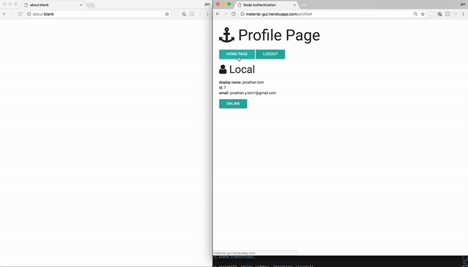

# Material Studio

Material Studio is a web app intended for beginner web designers to quickly build 
a simple website. Our drag and drop components are Materialize Design based - a unified 
user experience created by Google to simplify HTML and CSS web design. 

Users can easily create a site and see not only a dynamically rendered visual representation 
of their work-in-progress, but also their code base being built in real-time. Users can 
rapidly build a clean, professional, and simple site. Users can save their project on the 
cloud for future use, or locally to an HTML file for viewing in a browser or sharing with others. 
Users can also resume previously saved projects.

## Team

- Jonathan Tom  
- Alexi Taylor   
- Brandon Brown
- Colby Duhon




## Roadmap

View the project roadmap [here](LINK_TO_DOC)

## Contributing

See [CONTRIBUTING.md](CONTRIBUTING.md) for contribution guidelines.

# Table of Contents

1. [Usage](#Usage)
1. [Requirements](#requirements)
1. [Development](#development)
    1. [Installing Dependencies](#installing-dependencies)
    1. [Tasks](#tasks)

## Usage

> Some usage instructions

## Requirements

- Node 6.9.x
- Redis 3.2.x
- Postgresql 9.6.x
- etc

## Development

### Installing System Dependencies

```
brew install yarn
brew install redis
brew install postgresql
```

Yarn is a replacement for npm. It's faster and *guarantees* consistency -- as you deploy your code in various environments, you won't run the risk of slight variations in what gets installed.

### Install Project Dependencies

```
yarn global add grunt-cli knex eslint
```

## Database Initialization

IMPORTANT: ensure `postgres` is running before performing these steps.

### Database Creation:

Use grunt to create a new database for your development and test environments:

Development envronment: `grunt pgcreatedb:default`

Other environments, specify like so: `NODE_ENV=test grunt pgcreatedb:default`

### Run Migrations & Data Seeds

In terminal, from the root directory:

`knex migrate:latest --env NODE_ENV`

Do NOT run if first time setting up:

`knex migrate:rollback --env NODE_ENV`

`knex seed:run --env NODE_ENV`

Note: `--env NODE_ENV` may be omitted for development. For example, `knex migrate:latest` will run all migrations in the development environment, while `knex migrate:latest --env test` will migrate in the test environment.

## Running the App

To run webpack build: `yarn run build`

To run server: `yarn run start`

To run tests: `yarn run test`

To run your redis server for the session store `redis-server`
